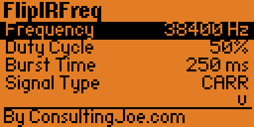

# FlipIRFreq

FlipIRFreq is a Flipper Zero external app for sending either a high-frequency IR carrier or a low-frequency IR pulse train with a user-selected frequency, duty cycle, burst length, and output pin.

## Features

- Two signal paths in one app:
  - `Carrier` mode for standard IR carrier generation
  - `Pulse` mode for low-frequency on/off IR pulsing
- Two transmit styles:
  - `Burst` for a timed send
  - `Continuous` for a sustained output until stopped
- Carrier frequency range: `10 kHz` to `1 MHz`
- Carrier frequency tuning:
  - tap `Left` / `Right` for `100 Hz`
  - hold `Left` / `Right` for `1 kHz`
- Pulse frequency range: `10.0 Hz` to `500.0 Hz`
- Pulse frequency tuning:
  - tap `Left` / `Right` for `0.1 Hz`
  - hold `Left` / `Right` for `1.0 Hz`
- Adjustable duty cycle from `1%` to `99%`
- Configurable burst length from `1 ms` to `5000 ms`
- Output routing:
  - `Auto`
  - `Internal`
  - `External (PA7)`
- Dedicated on-screen `Send` action
- Live `TX` animation while broadcasting
- Scrollable menu so the UI stays readable on the Flipper display
- Footer attribution matching the rest of the Flip app family
- Settings are persisted across launches
- Single-screen workflow optimized for quick testing and experimentation

## Screenshots

| Main | Pulse Mode |
| --- | --- |
|  |  |
| Main control screen for carrier transmission setup. | Pulse mode configured for low-frequency IR pulsing. |

| Send Screen |  |
| --- | --- |
|  |  |
| Transmit action selected and ready to start or stop output. |  |

## Menu Fields

The app exposes the following fields:

- `Frequency`
  - In `Carrier` mode this is the carrier frequency in Hz
  - In `Pulse` mode this is the pulse rate in tenths of a hertz, shown like `10.5 Hz`
- `Duty Cycle`
  - Output duty cycle percentage
- `Burst Time`
  - Timed transmit length used when `Tx Mode` is set to `Burst`
- `Signal Type`
  - Signal path: `CARR` or `PULSE`
- `Tx Mode`
  - Transmit style: `BURST` or `CONT`
- `IR Output`
  - Output routing: `AUTO`, `INT`, or `EXT`
- `Transmit`
  - Starts transmission
  - Changes to `STOP` while transmitting

## Signal Modes

### Carrier

- Uses the Flipper infrared HAL for high-frequency IR generation
- Best for normal IR carrier experiments and compatibility testing
- Supports `10 kHz` through `1 MHz`

### Pulse

- Uses direct GPIO timing on the selected IR output pin
- Best for low-frequency blinking, gating, and slow pulse experiments
- Supports `10.0 Hz` through `500.0 Hz`

## Controls

- `Up` / `Down`: select the field to edit
- `Left` / `Right`: change the selected value
- Hold `Left` / `Right`: adjust faster
- Move to `Send` and press `OK`: start transmitting
- Press `OK` while transmitting: stop transmitting
- Press `Back` while transmitting: stop transmitting
- Press `Back` while idle: exit the app

## Behavior Notes

- `Burst` mode stops automatically when the configured burst time completes
- `Continuous` mode keeps broadcasting until stopped by the user
- While transmitting, the current action is locked to the send/stop control so stopping is always one button press away
- A live `TX` indicator is shown while output is active
- After a stopped transmission, the header status shows `stopped`
- The selected row highlight has been tuned for better visibility on-device
- Settings are saved automatically and restored on next launch

## Notes

- `Auto` output uses the firmware's IR output detection to pick the active transmitter.
- `Carrier` mode uses the Flipper infrared stack with a raw single-mark signal at the selected carrier settings.
- `Pulse` mode drives the selected IR output pin directly for low-frequency on/off pulsing.
- This app is intended for bench testing, tuning, and experimentation with IR carrier behavior.

## Project Layout

- `flipirfreq.c` - main application source
- `application.fam` - Flipper Zero app manifest
- `assets/` - app assets
- `icon.png` - Flipper package icon

## Building

This repository contains a standard Flipper Zero external app layout and includes a helper script, `build.ps1`, that mirrors the project into your firmware tree and runs `fbt`.

Default usage:

```powershell
.\build.ps1
```

Preview the sync without copying, deleting, or building:

```powershell
.\build.ps1 -PreviewSync
```

Override the source or target directories explicitly:

```powershell
.\build.ps1 `
  -SourceDir C:\Users\Joe\Projects\FlipIRFreq `
  -FirmwareDir C:\Users\Joe\Projects\flipperzero-firmware `
  -TargetDir C:\Users\Joe\Projects\flipperzero-firmware\applications_user\flipirfreq
```

## Installing

1. Copy the generated `.fap` to your Flipper Zero SD card.
2. Launch `FlipIRFreq` from the Apps menu.

## Author

Created by ConsultingJoe.
